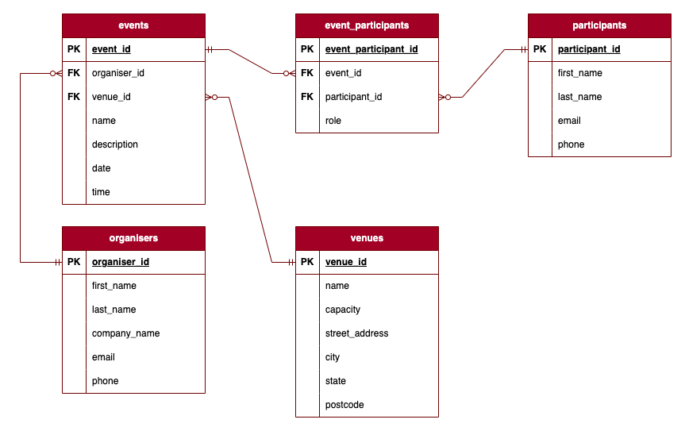

## Overview

The Event Management Web API is a Flask-based RESTful API designed to manage events, venues, organisers, participants, and their relationships efficiently. This project forms part of a coursework assessment and adheres to industry best practices, including error handling, validation, and modular design.

## ERD and relationships



### Relationships:

**Organisers to Events:**

- One Organiser can organize zero or many Events.
- Each Event must be organized by one and only one Organiser.
- **Notation**: **Organiser**  `(||)` - `(0..*)` **Event**

**Events to Event Participants:**

- One Event can have zero or many Event Participants.
- Each Event Participant must be associated with one and only one Event to track participants for individual events. Each Event Participant record is designed to link one participant to one event.
- **Notation**: **Event** `(||)` — `(0..*)` **Event Participant**

**Participants to Event Participants:**

- One Participant can be in zero or many Event Participants (to track individual, unique participant in each unique event).
- Each Event Participant must be associated with one and only one Participant.
- **Notation**: **Participant** `(||)` — `(0..*)` **Event Participant**

**Events to Venues:**

- One Event must be associated with one and only one Venue.
- One Venue can host zero or many Events.
- **Notation**: **Venue** `(||)` — `(0..*)` **Event**

## Application Setup

***Note***: The application is developed and tested on Python 3.12.5 and is confirmed to work on Unix-like systems (specifically macOS). Compatibility on other operating systems is not guaranteed. Below are the instructions for setting up the environment on macOS; please adjust as needed for your system.

### Clone the repository
Users can clone or fork the code of the application from its [GitHub repository](https://github.com/Donjella/assignment-2-CSA).

To clone this repository:

1. On this repository, above the list of files, click the green <> Code button. 

2. Copy the URL for the repository. To clone the repository using an SSH key, click SSH and copy the URL.  

3. Open Terminal.

4. Change the current working directory to the location where you want the cloned directory.

5. Type git clone, and then paste the URL you copied earlier 

    `git clone <SSH URL>`

6. Press ENTER to create your local clone.

More information about cloning a repository can be found [here](https://docs.github.com/en/repositories/creating-and-managing-repositories/cloning-a-repository).

----

### Create and activate a virtual environment

```bash
python3 -m venv .venv
source .venv/bin/activate # make sure virtual environment is activated
```

### Install dependencies

```bash
# Ensure pip is installed and upgraded to the latest version
python -m pip install --upgrade pip
# If installed, run the following in terminal:
pip install -r requirements.txt
```

### Configure environment variables in a .flaskenv file

```
FLASK_APP=main
FLASK_DEBUG=1
FLASK_RUN_PORT=8080
```

### Initialize the database

```bash
flask db create
flask db seed
```

### Run the application

```bash
flask run
```
## Testing
### Using Insomnia for tests:

1. Import the API collection and configure the base URL (e.g., http://localhost:8080).

2. Test CRUD operations for `venues`, `organisers`, `event_participants`, `participants` and `events` endpoints.

### API Endpoints

### Venue

- **GET /venues** - Retrieve all venues.
- **GET /venues/<venue_id>** - Retrieve a specific venue by ID.
- **POST /venues** - Create a new venue.
- **PUT/PATCH /venues/<venue_id>** - Update an existing venue.
- **DELETE /venues/<venue_id>** - Delete a venue.

### Organiser

- **GET /organisers** - Retrieve all organisers.
- **GET /organisers/<organiser_id>** - Retrieve a specific organiser by ID.
- **POST /organisers** - Create a new organiser.
- **PUT/PATCH /organisers/<organiser_id>** - Update an existing organiser.
- **DELETE /organisers/<organiser_id>** - Delete an organiser.

### Event

- **GET /events** - Retrieve all events.
- **GET /events/<event_id>** - Retrieve a specific event by ID.
- **POST /events** - Create a new event.
- **PUT/PATCH /events/<event_id>** - Update an existing event.
- **DELETE /events/<event_id>** - Delete an event.

### Participant

- **GET /participants** - Retrieve all participants.
- **GET /participants/<participant_id>** - Retrieve a specific participant by ID.
- **POST /participants** - Create a new participant.
- **PUT/PATCH /participants/<participant_id>** - Update an existing participant.
- **DELETE /participants/<participant_id>** - Delete a participant.

### Event Participant

- **GET /event_participants** - Retrieve all event participants.
- **GET /event_participants/<event_participant_id>** - Retrieve a specific event participant by ID.
- **POST /event_participants** - Create a new event participant record.
- **PUT/PATCH /event_participants/<event_participant_id>** - Update an event participant record.
- **DELETE /event_participants/<event_participant_id>** - Delete an event participant record.

## Technology Stack

- **Backend Framework**: Flask
- **Application Server**: Gunicorn
- **Database**: PostgreSQL (with SQLAlchemy for ORM), hosted on Neon.tech
- **Validation**: Marshmallow
- **Deployment Platform**: Render

## Explanation on chosen database system 

For this project, we have chosen PostgreSQL, a powerful and highly versatile relational database management system (RDBMS). PostgreSQL is known for its robustness, scalability, and extensive feature set, making it an ideal choice for managing complex data relationships, ensuring data integrity, and handling concurrent transactions efficiently.

### Why PostgreSQL?

1. **Relational Database:** PostgreSQL is a relational database, meaning it organizes data into tables with rows and columns. This structure is highly effective for managing structured data and enforcing data integrity through relationships and constraints.

2. **ACID Compliance:** 
   PostgreSQL ensures data integrity and reliability through ACID (Atomicity, Consistency, Isolation, Durability) compliance, which is essential for transactional applications like our Event Web API.

   * **Atomicity:** Ensures that all operations within a transaction are completed successfully or none at all. For instance, when creating an event, the process includes inserting event details, assigning a venue, and linking an organizer. If any step fails, the database rolls back to its previous state, preventing partial or inconsistent data.

   * **Consistency:** Guarantees that each transaction preserves the integrity of the database by enforcing all rules and constraints. For example, assigning an event to a venue ensures the venue exists and complies with foreign key constraints, avoiding invalid or orphaned data entries.

   * **Isolation:** Ensures that concurrent transactions do not interfere with each other. For example, if two users simultaneously attempt to book the same venue for different events, PostgreSQL’s isolation mechanisms prevent conflicts and ensure accurate venue availability.

   * **Durability:** Ensures that once a transaction is committed, its results are permanent, even in the event of a system failure. This means that after an event is successfully created or updated, the data remains reliably stored and recoverable.

   By leveraging PostgreSQL's ACID compliance, our Event Web API guarantees that all operations, such as creating, updating, or deleting events, are processed reliably and maintain data integrity throughout the system.

3. **Open Source:** Free to use, modify, and distribute, reducing licensing costs and allowing for community-driven development.

4. **Advanced Data Types:** PostgreSQL's support for advanced data types like JSONB, arrays, and hstore provides flexibility in data modeling. JSONB, in particular, enables efficient storage, fast querying, and indexing of JSON documents. This is especially useful for managing event metadata or dynamic attributes that can vary between events, offering adaptability for evolving application requirements.

5. **Advanced Features:** PostgreSQL supports advanced features such as complex queries, full-text search, and custom functions, which are essential for building sophisticated applications. These capabilities are particularly valuable for implementing features like event search, filtering, and reporting in the Event Web API, enabling efficient retrieval and processing of data.

6. **Extensibility:** PostgreSQL is highly extensible, allowing users to define custom data types, operators, and functions. This flexibility makes it suitable for a wide range of applications.


### Comparison to Other Database Systems

#### 1. MySQL (Relational Database)
- **Similarities**: Like PostgreSQL, MySQL is a relational database that uses SQL for querying and managing data. Both are open-source and widely used.
- **Differences**: While MySQL is known for its speed and ease of use, PostgreSQL offers more advanced features and greater extensibility. PostgreSQL's compliance with SQL standards is stronger, making it suitable for more complex applications.

#### 2. MongoDB (NoSQL Database)
- **Type**: MongoDB is a NoSQL database, meaning it stores data in a flexible, schema-less format using documents (JSON-like structures).
- **Use Cases**: MongoDB is ideal for applications that require high scalability, flexible data modeling, and rapid development cycles. It excels in handling large volumes of unstructured or semi-structured data.
- **Comparison**: While PostgreSQL is great for structured data and complex queries, MongoDB is better suited for scenarios where flexibility and scalability are more critical than strict data integrity.

#### 3. SQLite (Embedded Database)
- **Type**: SQLite is an embedded, file-based relational database.
- **Use Cases**: SQLite is lightweight and easy to set up, making it ideal for small applications, embedded systems, and testing.
- **Comparison**: Unlike PostgreSQL, SQLite lacks advanced features, scalability, and concurrent access capabilities. PostgreSQL is more suitable for larger applications requiring robust transaction management and multi-user support.

#### 4. Microsoft SQL Server (Relational Database)
- **Type**: SQL Server is a commercial relational database developed by Microsoft.
- **Use Cases**: SQL Server is commonly used in enterprise environments, especially those already using other Microsoft products.
- **Comparison**: Both PostgreSQL and SQL Server offer robust features and support for complex queries. However, SQL Server requires licensing fees, while PostgreSQL is free and open-source.
